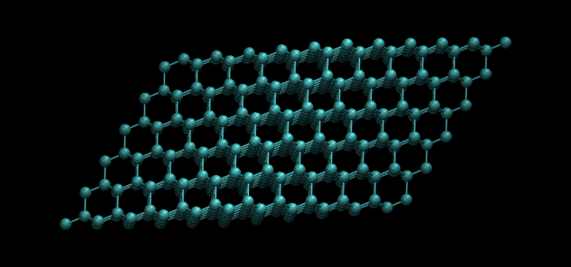

# Phonon Dispersion of a Spring Based Atomistic System

###### [citation](http://exciting-code.org/beryllium-animate-phonons)
## What is a phonon?
Phonons are the quantized vibrational modes of solid structures. 
## Project Description
This project will explore calculating phonons on spring based solids. It will build a visual representation of different atomic materials using vpython.
# License
This project is licensed under the MIT license. The LICENSE file contains the MIT license.

# Running the Jupyter Notebook
Pieces of the project are described in the included jupyter notebooks. These notebooks can be used as reference for viewing the atomic systems, with notes added describing the physics. To run them, from the project's main directory, execute `$ jupyter notebook` Note that you'll need to first install jupyter. If you already have vpython installed, then this should already be included. If not create a virtual environment with `$ python -m venv env` then `$ pip install vpython jupyter`.